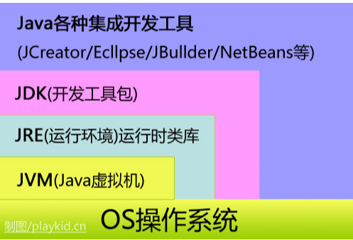
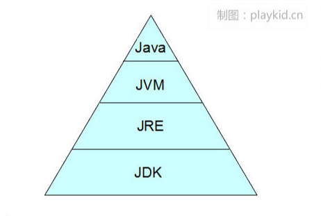
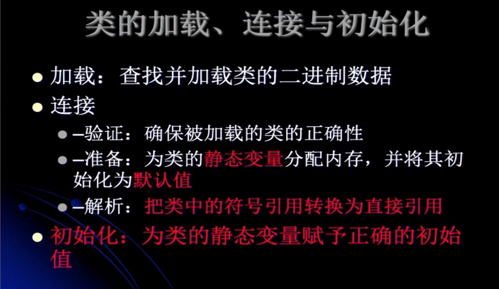

**JDK的组成**




JDK（Java Development Kit）是针对Java开发员的产品，是整个Java的核心，包括了Java运行环境JRE、Java工具和Java基础类库。Java Runtime Environment（JRE）是运行JAVA程序所必须的环境的集合，包含JVM标准实现及Java核心类库。JVM是Java Virtual Machine（Java虚拟机）的缩写，是整个java实现跨平台的最核心的部分，能够运行以Java语言写作的软件程序。 




　　　金字塔结构 JDK=JRE+JVM+其它 运行Java程序一般都要求用户的电脑安装JRE环境（Java Runtime Environment）；没有jre，java程序无法运行；而没有java程序，jre就没有用武之地。

　　**Java Runtime Environment（JRE）**

```
是运行基于Java语言编写的程序所不可缺少的运行环境。也是通过它，Java的开发者才得以将自己开发的程序发布到用户手中，让用户使用。
　　JRE中包含了Java virtual machine（JVM），runtime class libraries和Java application launcher，这些是运行Java程序的必要组件。
　　与大家熟知的JDK不同，JRE是Java运行环境，并不是一个开发环境，所以没有包含任何开发工具（如编译器和调试器），只是针对于使用Java程序的用户。
```

  	 **JVM（java virtual machine）**

```
　就是我们常说的java虚拟机，它是整个java实现跨平台的最核心的部分，所有的java程序会首先被编译为.class的类文件，这种类文件可以在虚拟机上执行。
　也就是说class并不直接与机器的操作系统相对应，而是经过虚拟机间接与操作系统交互，由虚拟机将程序解释给本地系统执行。
　只有JVM还不能成class的执行，因为在解释class的时候JVM需要调用解释所需要的类库lib，而jre包含lib类库。
　JVM屏蔽了与具体操作系统平台相关的信息，使得Java程序只需生成在Java虚拟机上运行的目标代码（字节码），就可以在多种平台上不加修改地运行。
```


-------------------------


**JVM**




​	


