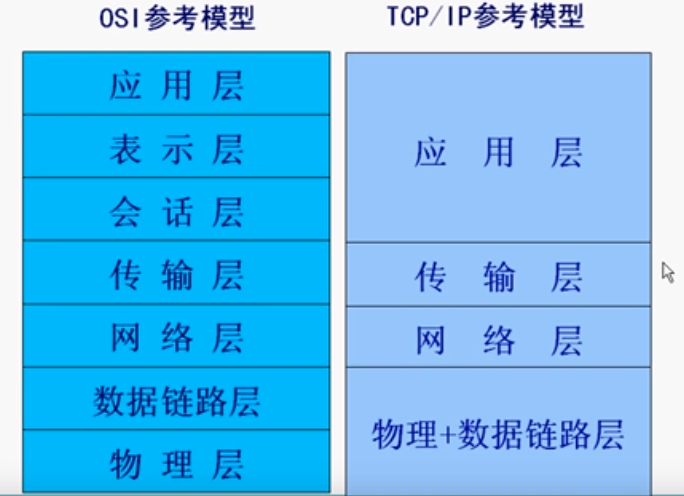
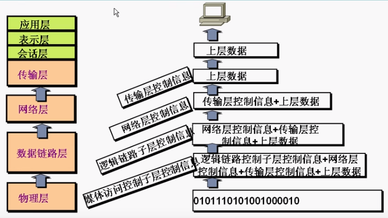

**产看端口进程**

```
ps -ef | grep elastic

lsof -i:9200
```

**查看ip**

```
//查看win ip
ipconfig

//查看linux ip
ifconfig
//错误
-bash: ifconfig: command not found
yum install net-tools
```


**JVM内存**

```
jmap 203308

jmap -heap 203308
 
jmap -histo:live 203308 | head -n 50
 
jmap -dump:format=b,file=heapdump 203308
jhat -port 4000 heapdump
http://192.168.4.17:4000/
 
https://www.jianshu.com/p/43b2ecdfe005	
https://www.cnblogs.com/z-sm/p/6745375.html
```


**带宽**

```
查看网卡
ifconfig

产看网卡速度  注意单位B、b（1024，1000）
ethtool ens7f0

监视流量
nload
```


**查看系统资源**

```
top
iostat
```


**哈希**

```
openssl dgst -sha1 placeName0118.tar
```


**端口查询**

```
netstat命令各个参数说明如下：
　　-t : 指明显示TCP端口
　　-u : 指明显示UDP端口
　　-l : 仅显示监听套接字(所谓套接字就是使应用程序能够读写与收发通讯协议(protocol)与资料的程序)
　　-p : 显示进程标识符和程序名称，每一个套接字/端口都属于一个程序。
　　-n : 不进行DNS轮询，显示IP(可以加速操作)
即可显示当前服务器上所有端口及进程服务，于grep结合可查看某个具体端口及服务情况··
netstat -ntlp   //查看当前所有tcp端口·
netstat -ntulp |grep 80   //查看所有80端口使用情况·
netstat -ntulp | grep 3306   //查看所有3306端口使用情况·

LISTENING并不表示端口被占用，不要和LISTEN混淆 
```

**后台执行**

```
nohup java -jar ./CMDRunner.jar --tool PerfMonAgent --udp-port 7777 --tcp-port 7777 > log  &
```

**du**

```
du -k / -m / -g 文件
du -h 文件 //递归查询  以最好的单位展现
du -h --max-depth=0 3DTiles/  不递归

df
df -h 文件名		以最好的单位展现
```

**打包 tar**

```
tar 
1.压缩
tar -cvf /home/xahot.tar.gz /output				/		tar -zcvf /home/xahot.tar.gz /output	
tar -cvf 打包后生成的文件名全路径 要打包的目录
2.解压
tar -xvf file.tar 							  /		   tar -zxvf file.tar 	

zip
1. 我想把一个文件abc.txt和一个目录dir1压缩成为yasuo.zip：
＃ zip -r yasuo.zip abc.txt dir1
2.压缩：
# unzip yasuo.zip

```

**Anaconda**

```
conda create -n env_name python=2.7
Linux进入:  source activate your_env_name(虚拟环境名称)
Linux退出:  source deactivate your_env_name(虚拟环境名称)
```

**vi**

```
:%s/vivian/sky/g   替换每一行中所有 vivian 为 sky
:set nu
:set ic 不区分大小写
/cha   查找
:.,$d   表示从当前行到末行全部删除掉
grep "192.168.5.141" -r /opt/  根据内容查找
```

**RZ SZ**

```
下载	yum -y install lrzsz 

覆盖上传 rz -y
```

**查找文件**

```
1.在某个目录下查看含有某个字段的文件 

find . | xargs grep "custom" 

find . -type f | xargs grep "custom' 

2.以文件名字查找文件
find . -name fileName -type d


```

**防火墙**

```
firewall-cmd --state 

systemctl stop firewalld 

systemctl disable firewalld 

```

**查看系统版本、CPU**

```
系统版本
cat /proc/version
cat /etc/redhat-release 

# 查看物理CPU个数
cat /proc/cpuinfo| grep "physical id"| sort| uniq| wc -l

# 查看每个物理CPU中core的个数(即核数)
cat /proc/cpuinfo| grep "cpu cores"| uniq
```

**杂项**

```
ll ls命令消失
export PATH=/usr/local/sbin:/usr/local/bin:/sbin:/bin:/usr/sbin:/usr/bin:/root/bin 

```

**内存**

```
Linux下的大页分为两种类型：标准大页（Huge Pages）和透明大页（Transparent Huge Pages）。Huge Pages有时候也翻译成大页/标准大页/传统大页，它们都是Huge Pages的不同中文翻译名而已，顺带提一下这个，免得有人被这些名词给混淆、误导了。Huge Pages是从Linux Kernel 2.6后被引入的。目的是使用更大的内存页面（memory page size） 以适应越来越大的系统内存，让操作系统可以支持现代硬件架构的大页面容量功能。透明大页（Transparent Huge Pages）缩写为THP，这个是RHEL 6（其它分支版本SUSE Linux Enterprise Server 11, and Oracle Linux 6 with earlier releases of Oracle Linux Unbreakable Enterprise Kernel 2 (UEK2)）开始引入的一个功能。具体可以参考官方文档。这两者有啥区别呢？这两者的区别在于大页的分配机制，标准大页管理是预分配的方式，而透明大页管理则是动态分配的方式。相信有不少人将Huge Page和Transparent Huge Pages混为一谈。目前透明大页与传统HugePages联用会出现一些问题，导致性能问题和系统重启。Oracle 建议禁用透明大页（Transparent Huge Pages）。在Oracle Linux 6.5 版中，已删除透明 HugePages。 

linux 会使用硬盘的一部分做为SWAP分区，用来进行进程调度--进程是正在运行的程序--把当前不用的进程调成‘等待（standby）‘，甚至‘睡眠（sleep）’，一旦要用，再调成‘活动（active）’，睡眠的进程就躺到SWAP分区睡大觉，把内存空出来让给‘活动’的进程。 　　如果内存够大，应当告诉 linux 不必太多的使用 SWAP 分区， 可以通过修改 swappiness 的数值。swappiness=0的时候表示最大限度使用物理内存，然后才是 swap空间，swappiness＝100的时候表示积极的使用swap分区，并且把内存上的数据及时的搬运到swap空间里面。 　　在ubuntu 里面，默认设置swappiness这个值等于60。 　　 　　!!!! 如果内存较小，而进程调度频繁，硬盘的响动就会大了 !!!! 

```


---


### BBR与SSR和VPN

BBR是google出的一种协议，解决网络拥堵，实现更快的访问速度

SSR和VPN是一样的，实现科学上网，我们访问一台能访问其国外服务器的服务器，通过它转发、接收再回转发，实现访问国外网站

### MAC地址和IP地址

MAC地址是每台机器的物理地址，当从一个IP访问另一个IP 是通过一个个硬件转发的，他们都有自己的MAC地址

### 交换机和集线器

交换机会通过ARP包找到想目的地，然后指向性的转发  集线器是转发到集线器连接的各个节点，也就是广播的形式

### Linux tc(Traffic Control)

```
ping

模拟网络超时100ms 

tc qdisc add dev eno16780032  root netem delay 100ms 

ping

删除

tc qdisc del dev eno16780032 root

延时100毫秒，上下浮动10毫秒 

tc qdisc add dev eno16780032 root netem delay 100ms 10ms 

丢包

tc qdisc add dev eno16780032 root netem loss 50% 

重复包 

tc qdisc add dev eno16780032 root netem duplicate 50% 

坏包 

tc qdisc add dev eno16780032 root netem corrupt 50% 

50%的包立即发送，其他的包延时10毫秒 

tc qdisc add dev eno16780032 root netem delay 10ms reorder 50%


tc qdisc del dev eno16780032 root

scp -r 

tc qdisc add dev eno16780032 root handle 1: htb

tc class add dev eno16780032 parent 1: classid 1:1 htb rate 30mbit ceil 60mbit  

tc filter add dev eno16780032 parent 2: protocol ip prio 16 u32 match ip dst 192.168.4.226  flowid 2:2 


scp -r jdk-7u80-linux-x64.tar.gz root@192.168.4.226:/pwd/atmp


参考网站

https://www.linuxidc.com/Linux/2017-12/149703.htm

https://blog.csdn.net/hardlearn/article/details/78034951

https://www.fujieace.com/linux/man/tc.html

http://codeshold.me/2017/01/tc_detail_inro.html 

https://blog.51cto.com/dog250/1568267 

http://perthcharles.github.io/2015/06/12/tc-tutorial/ 

```

### Tcp Udp



传输层 tpc udp

网络层 ip

数据链路层  mac




 

ip独一无二的 公网地址


tcp 可靠

udp快