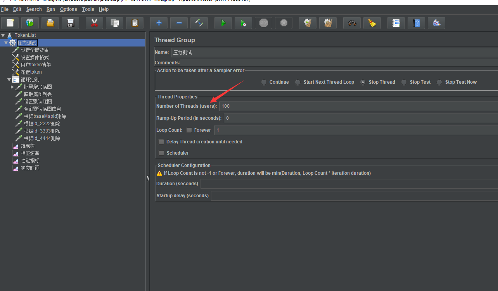
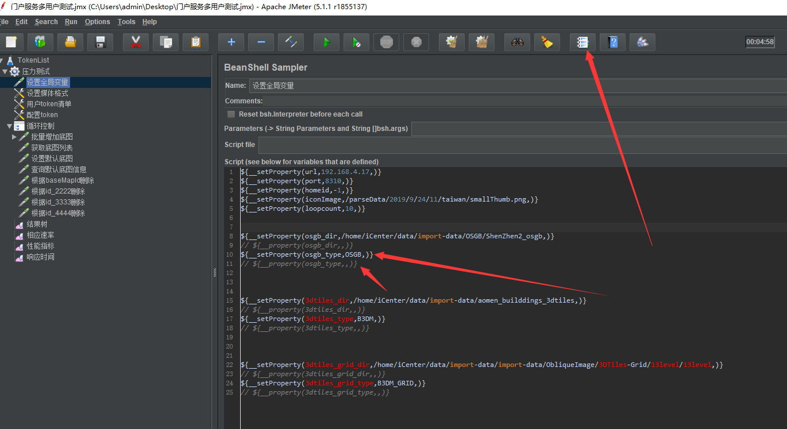
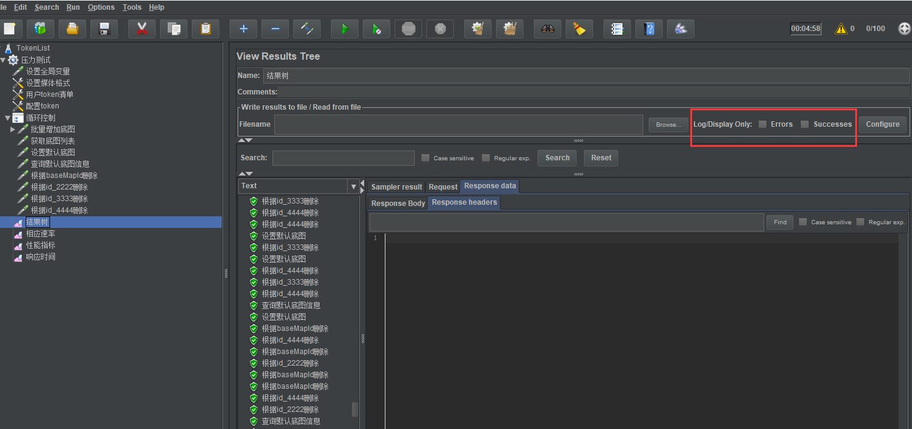
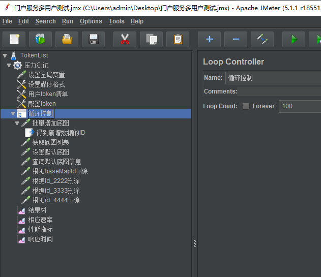

分布式

```
windows 本机为主节点
linux 三台从节点
192.168.4.17
192.168.4.16
192.168.4.98


四台机子都安装jmter


linux
分别进入3台机子的jmeter的bin 修改配置文件jmeter.properties
remote_hosts=192.168.4.17:1099				//ip为此linux本机ip，端口为非占用端口
后台运行监听程序，监听发来的请求
./jmeter-server -Djava.rmi.server.hostname=192.168.4.17 > log  &
./jmeter-server -Djava.rmi.server.hostname=192.168.4.18 > log  &
./jmeter-server -Djava.rmi.server.hostname=192.168.4.98 > log  &


windows
进入安装目录的bin  修改配置文件jmeter.properties
remote_hosts=192.168.4.17:1099,192.168.4.18:1099,192.168.4.98:1099

jmeter.bat启动 书写脚本
运行 -> 远程启动/远程启动所用

运行上万线程，本机没有丝毫卡顿
```


增加线程组



全局变量



结果树



正则拦截


循环




