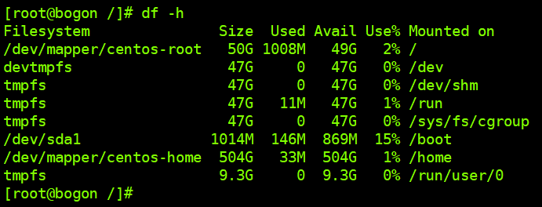

**阿里yum源**

```
wget -O /etc/yum.repos.d/CentOS-Base.repo http://mirrors.aliyun.com/repo/Centos-7.repo

yum clean all 
yum makecache 
yum repolist
yum update
```


**rz sz**

```
下载	yum -y install lrzsz 

覆盖上传 rz -y
```


**anaconda pip**

```
安装教程
https://zhuanlan.zhihu.com/p/64930395

配置清华anaconda源
    conda config --add channels 'https://mirrors.tuna.tsinghua.edu.cn/anaconda/pkgs/free/'
    conda config --set show_channel_urls yes
查看配置文件
	cd $HOME 
	vi .condarc
安装软件出错
	SSLError(MaxRetryError('HTTPSConnectionPool(host=\'mirrors.ustc.edu.cn\', port=443)
解决
	下载OpenSSL源码
		wget http://www.openssl.org/source/openssl-1.0.2j.tar.gz
	编译安装
        tar -zxvf openssl-1.0.2j.tar.gz
        cd openssl-1.0.2j
        ./config --prefix=/usr/local/openssl-1.0.2j shared zlib
        make && make install


安装工具pip       
    yum -y install epel-release               
    yum -y install python-pip                
    pip --version 
若要更新pip
	pip install --upgrade pip

配置清华pip国内源
    cd $HOME  
    mkdir .pip  
    cd .pip
    sudo vim pip.conf  
在里面添加  
[global]  
index-url=https://pypi.tuna.tsinghua.edu.cn/simple
[install]
trusted-host=pypi.tuna.tsinghua.edu.cn 
disable-pip-version-check = true  
timeout = 6000 
```


**安装centos**

<https://note.youdao.com/ynoteshare1/index.html?id=1caa3e20f68caab07f248f8c7eea3083&type=note> 

raid0  raid1  raid5  raid10 区别

<https://blog.csdn.net/Mr_Yang__/article/details/85228465> 

重启服务器


ctr + r  进入磁盘


将raid1格式化

​	F2   fast init 

**接raid5** 

删除所有raid5组


根目录创建 raid0


重新进入光盘（因为系统盘已经被格式化）


选择 语言 安装目录 密码（太简单，需要done两次）


更具体的操作看原作

重新进入系统
设置网卡
cd /etc/sysconfig/network-scripts
ip addr
vi ifcfg-enp26s0f0
systemctr restart network


**系统备份**

<https://blog.csdn.net/tham_/article/details/50402109> 

系统初始状态




```
cd /

tar cvpzf backup.tgz / --exclude=/proc --exclude=/lost+found --exclude=/backup.tgz --exclude=/mnt --exclude=/sys

tar xvpfz backup.tgz -C /

mkdir proc
mkdir lost+found
mkdir mnt
mkdir sys

restorecon -Rv /

reboot
```


